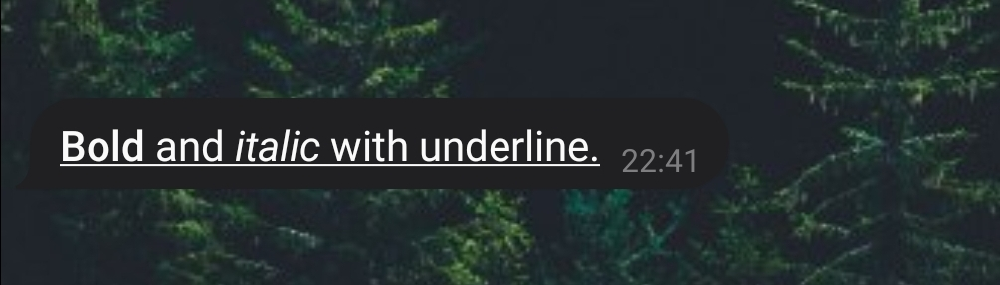
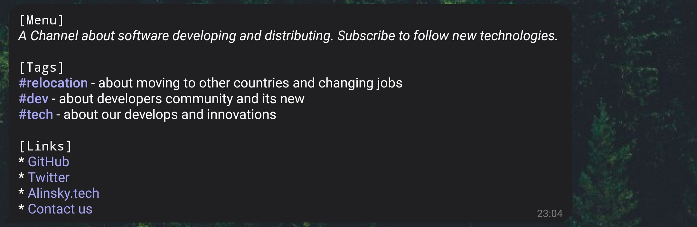

Overview
========

Python markup module for Telegram messenger.
This module provides a rich list of components to build any possible
markup fast and render it to specific *html* or *MarkdownV2* formats.

.. image:: https://img.shields.io/pypi/pyversions/telegram-text.svg
   :target: https://github.com/SKY-ALIN/telegram-text

.. image:: https://github.com/SKY-ALIN/telegram-text/actions/workflows/tests.yml/badge.svg
   :target: https://github.com/SKY-ALIN/telegram-text

.. image:: https://github.com/SKY-ALIN/telegram-text/actions/workflows/code-quality.yml/badge.svg
   :target: https://github.com/SKY-ALIN/telegram-text

.. image:: https://codecov.io/gh/SKY-ALIN/telegram-text/branch/dev/graph/badge.svg?token=BK0ASC89B9
   :target: https://codecov.io/gh/SKY-ALIN/telegram-text

.. image:: https://badge.fury.io/py/telegram-text.svg
   :target: https://pypi.org/project/telegram-text/

.. image:: https://img.shields.io/github/license/SKY-ALIN/telegram-text.svg
   :target: https://github.com/SKY-ALIN/telegram-text/blob/main/LICENSE

Installation
------------

Install using :code:`pip install telegram-text` or :code:`poetry add telegram-text`.

Basic Example
-------------

.. code-block:: python

   from telegram_text import Bold, Italic, Underline

   text = Underline(Bold("Bold") + "and" + Italic("italic") + "with underline.")

Advanced Example
----------------

.. code-block:: python

   from telegram_text import Bold, Chain, Italic, TOMLSection, Hashtag, Link, UnorderedList

   description = "A Channel about software developing and distributing. Subscribe to follow new technologies."
   tags: dict[str, str] = {...}  # Tags description with following format `tag: tag_description`
   links: dict[str, str] = {...}  # Links with following format `text: url`

   menu = Chain(
       TOMLSection(
           'Menu',
           Italic(description),
       ),
       TOMLSection(
           'Tags',
           *[Hashtag(tag, style=Bold) + f"- {about}" for tag, about in tags.items()],
       ),
       TOMLSection(
           'Links',
           UnorderedList(*[Link(text, url) for text, url in links.items()]),
       ),
       sep='\n\n'
   )

.. toctree::
   :maxdepth: 2
   :caption: Contents
   :hidden:

   self
   User Guide <user_guide/index>
   api_reference

.. toctree::
   :caption: Development
   :hidden:

   changelog
   license
   GitHub Repository <https://github.com/SKY-ALIN/telegram-text>
   PyPI Page <https://pypi.org/project/telegram-text/>
