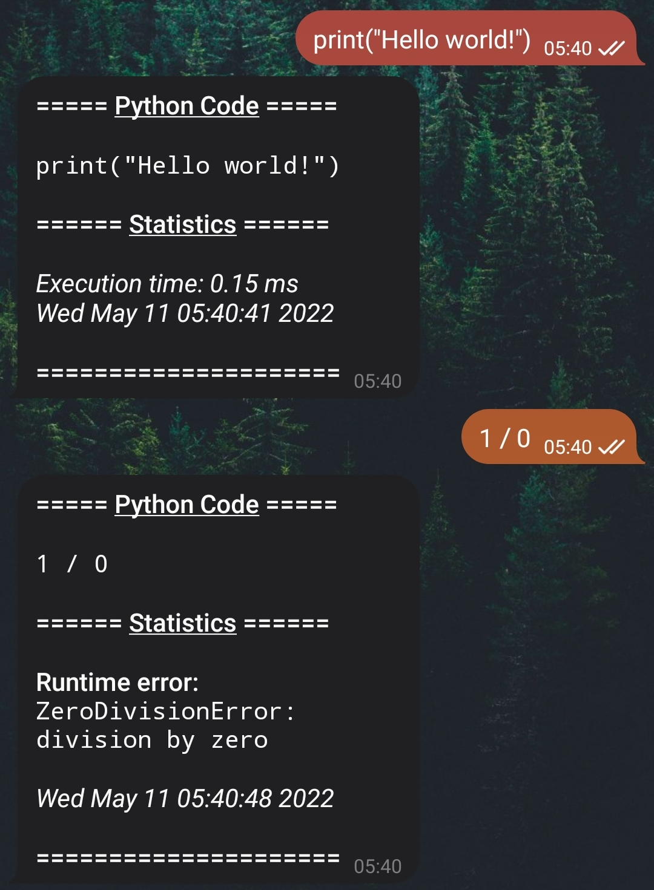

Example With ``telebot``
========================

Let's write a basic formatting project with :code:`telebot` module to work
with Telegram bots API. This bot makes pretty code formatting and calculates
basic statistics.

.. literalinclude:: code_example.py
   :language: python

